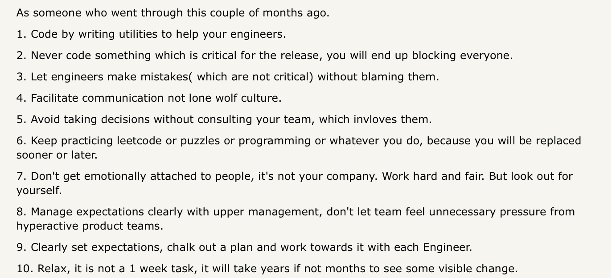
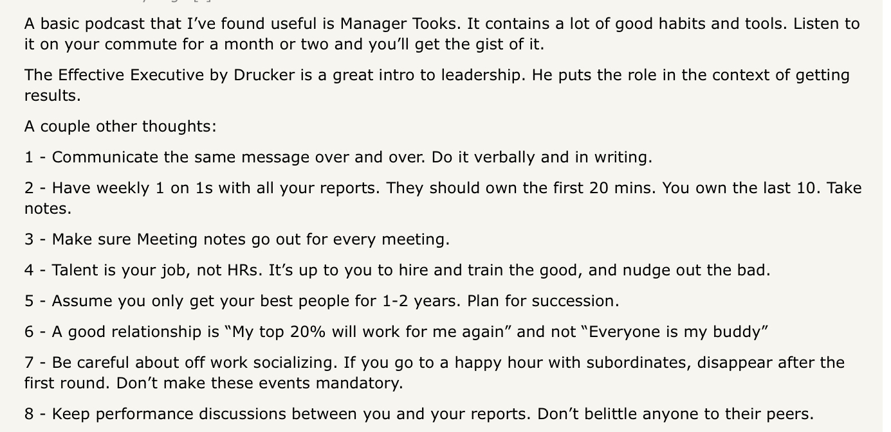
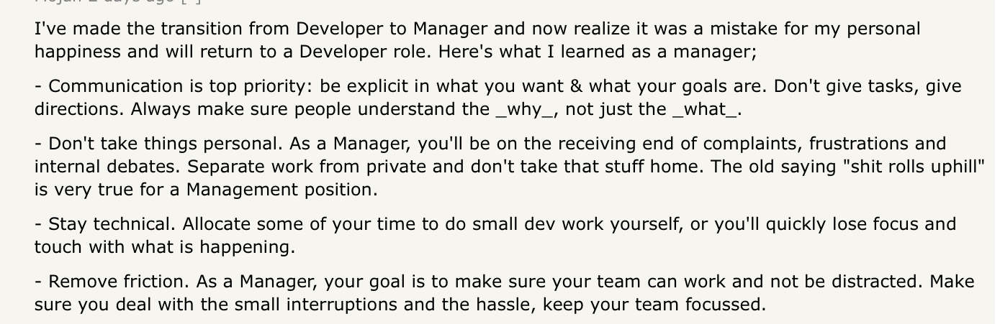

# 👶What is Management?

## Absolute basic requirements of the role
1. Be a good coach
2. Empower the team and do not micromanage
3. Express interest/concern for team members’ success and personal well being
4. Be very productive/results-oriented
5. Be a good communicator – listen and share information
6. Help the team with career development
7. Have a clear vision/strategy for the team
8. Have important technical skills that help advise the team
9. Share context. Explain the why for everything you ask them to do.

## What people want
- A mentor
- A coach
- A teacher
- A listener
- A supporter
- A motivator
- A confidant
- An accountability partner
- An advocate
- An advisor
- A leader
- A friend

## "Presidential rules"
- ***Your job is to ask questions and flush out ideas, not to give yours***
- 3 manager death sentences: **get angry, lie or guess**
- The only thing you can change is yourself

forgot where this is from, it's a set of rules about how presidents should behave

## Great tips (source: HN)

## References

[Ask HN: Going from Developer to Manager. What should I know or learn? | Hacker News](https://news.ycombinator.com/item?id=18823616)