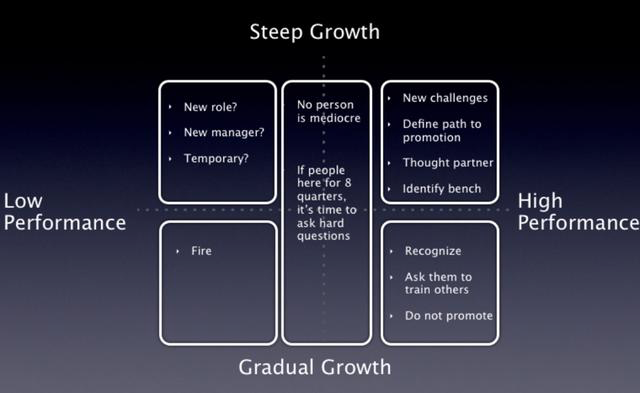
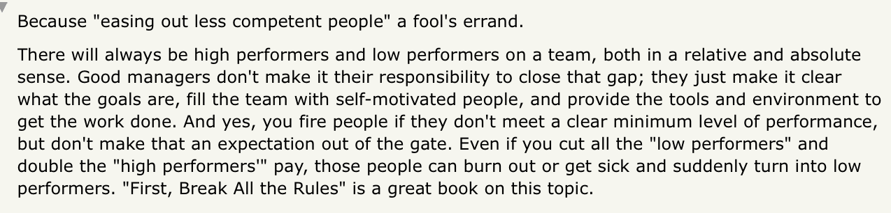

# Coaching for Growth

Coaching for Growth == levelling up individuals who may not _yet_ be up-to-par. Coaching for performance == levelling up already stellar individuals

## The basics
- Find person’s long term ambitions first (can't grow someone in a direction they don't want to)
- Steep vs Gradual growth phases - **focus on depth (gradual) or impact (steep)**
- Find out where person finds **meaning**, create an environment to help them w that
- Don’t offer solutions, offer *challenges*
- Junior devs/newcomers: ask as many clarifying questions as possible (don't know what I don't know)

## You can't "keep only top performers" 

## References

[My Management Lessons from Three Failed Startups, Google, Apple, Dropbox, and Twitter](https://firstround.com/review/My-Management-Lessons-from-Three-Failed-Startups-Google-Apple-Dropbox-Twitter-and-Square/)