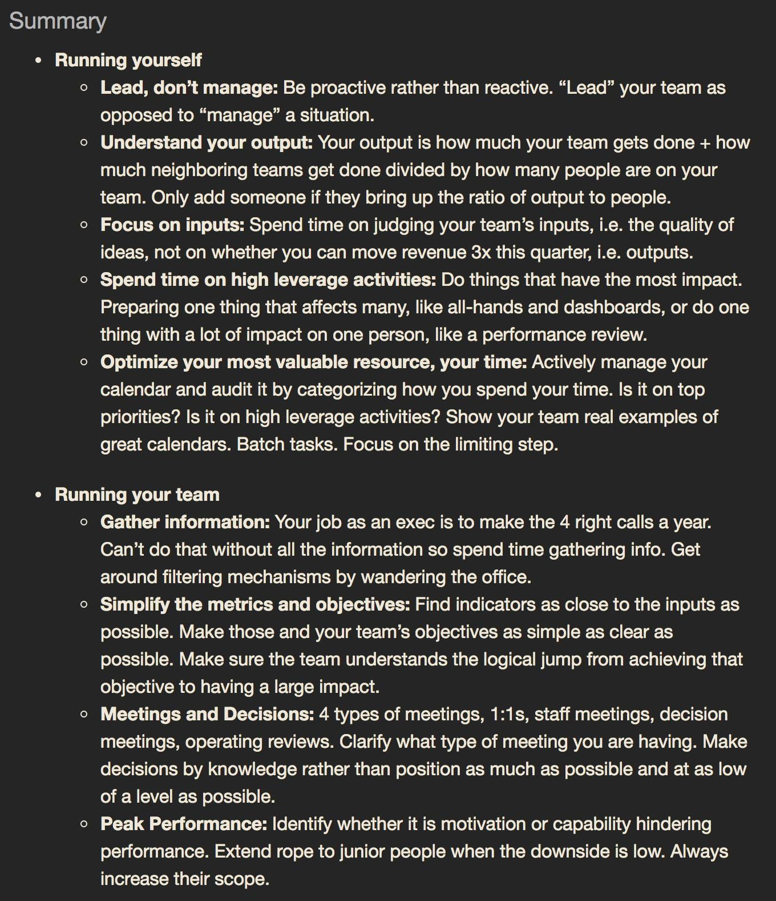

# Leadership 101

## What is leadership?

- Leadership is NOT management.
- Leadership is NOT about you.
- Leadership is about trying to write yourself out of a job by EMPOWERING others to take over and head towards success.
- Leadership IS NOT
    - Witholding information or techniques
    - Isolating individuals
    - Building a team around you for the sake of ego
- Leadership IS
    - Helping the team understand the strategy
    - Enabling them to operate in your absense
    - Empowering them to make decisions and take risks, protected by your influence.

## Techniques 

- Explain why a lot
- Make it clear what success looks like and people have a reason to achieve it
- Clear objectives and mission, point the way
- Find an external enemy (if you need one)
- Focus more time on the top performers

## References

- [Great leadership isn't about you](https://hbr.org/2014/08/great-leadership-isnt-about-you)
- [What leadership is not](https://www.lollydaskal.com/leadership/what-leadership-is-not/)