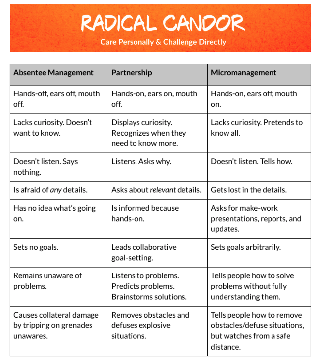

# 👇Manager:Report contract

## Make sure everything finishes, give feedback and keep them unblocked.

- It’s OK TO MESS UP. Explicitly let them know this, and act accordingly.
- It’s ok for you to suggest technical changes, but be clear on why and try to do it only to 1) prevent tech debt/accidental complexity or 2) address use cases the team is not seeing
- Make the contract clear
    - Make the career ladder clear. Make the job expectations clear.
    - Don't assume /anyone/ knows even the basics, like career progression.

## Coach for results & quality

- If someone is underperforming, BE CLEAR TO THEM.
- If someone is over-performing, be clear about the requirements for the next level and help them get there!
- Go hands on, but don’t block progress. If you don’t go hands on, you’ll not be able to verify if things are being done properly. If you take big features, you’ll not have time for your role and/or do incomplete work

## Build the bridges

- Share information with them. As much as possible, as often as possible, even if you don’t know what to do with that information. They may know.
- Be EXEMPLARY. Everyone will do something you do - eg if you do PRs with no context, don’t expect or ask the team to get any better at theirs. If you don't care about uptime, don't expect the team to operate anything with quality.

## Be present but don't micromanage

