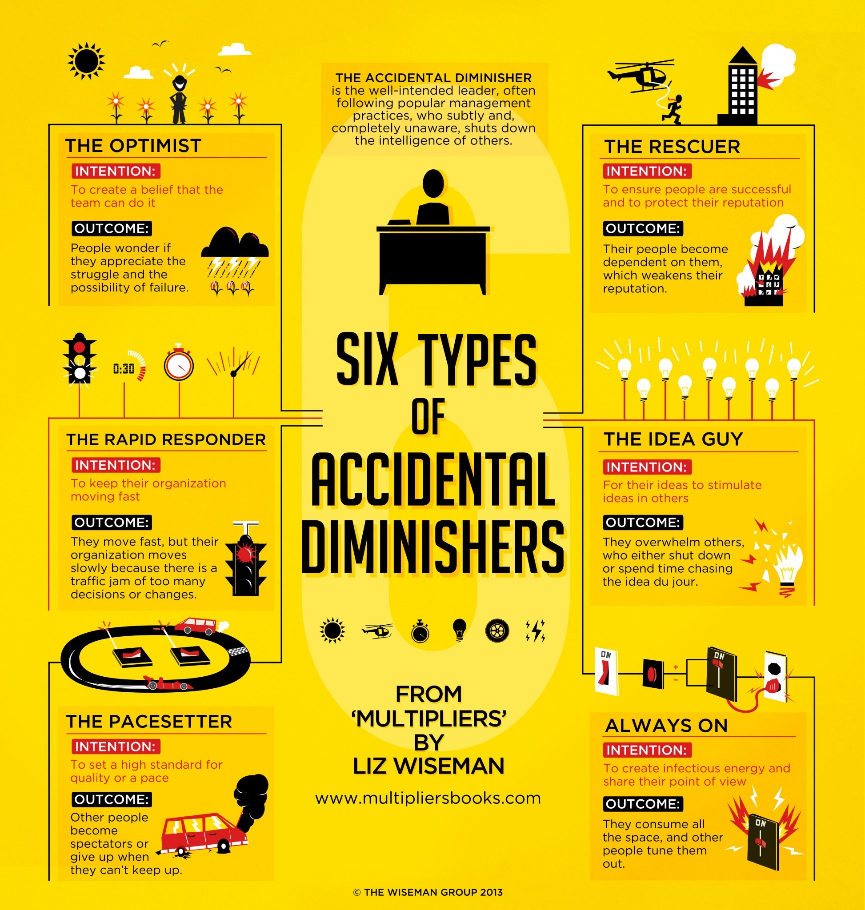

# Accidental Diminishers

- Well-honed leaders make everyone around them stronger
- Diminishers make the team less effective - either intentionally or (most of the time) _accidentally_.

## Multipliers vs Diminishers

### Multiplier traits
“People are smart and will figure this out.”

- *Talent Magnet*: Attracts talented people and uses them at their highest point of contribution
- *Liberator*: Creates an intense environment that requires people’s best thinking and work
- *Challenger*: Defines an opportunity that causes people to stretch
- *Debate Maker*: Drives sound decisions through rigorous debate
- *Investor*: Gives other people the ownership for results and invests in their success

### Diminisher traits
“They will never figure this out without me.”

- *Empire Builder*: Hoards resources and underutilizes talent
- *Tyrant*: Creates a tense environment that suppresses people’s thinking and capability
- *Know-It-All*: Gives directives that showcase how much they know
- *Decision Maker*: Makes centralized, abrupt decisions that confuse the organization
- *Micro-Manager*: Drives results through personal involvement

## Intentions & Outcomes

### Idea Guy          
| Intention | Outcome | How to improve | Multiplier experiments |
|-----------|---------|----------------|------------------------|
| For their ideas to stimulate ideas in others. | Outcome: They overwhelm others who either shutdown or spend time chasing the idea du jour. | Create a Holding Tank. Before you share a new idea, stop and ask yourself if you want the people who work for you to take action on it–right now. If not, hold off sharing it, and put it into a holding tank in your brain or on a piece of paper. | Extreme Questions |

### Pacesetter
| Intention | Outcome | How to improve | Multiplier experiments |
|-----------|---------|----------------|------------------------|
| To set a high standard for quality or pace. | Other people become spectators or give up when they can’t keep up. | Stay Within Sight. If you have a tendency to pull out ahead, remind yourself to stay within sight so people don’t give up or get lose. Don’t get more than two to three car lengths ahead of the pack; don’t go around a corner. Stay within distance that someone could realistically catch up. | Give 51% of the Vote |

### Always On
| Intention | Outcome | How to improve | Multiplier experiments |
|-----------|---------|----------------|------------------------|
| To create infectious energy and share their point of view. | They consume all the space and other people tune them out. | Say It Just Once. When we are most excited, we tend to repeat ourselves and re-explain for emphasis, hoping to get positive reactions from our colleagues. Avoid over-contributing by saying the important things just once, and create a reason for others to him in and build on the idea. | Play Fewer Chips, Give 51% of the Vote | 

### Rapid Responder
| Intention | Outcome | How to improve | Multiplier experiments |
|-----------|---------|----------------|------------------------|
| To keep their organization moving fast. | They move fast but their organization moves slowly because there is a traffic jam of too many decisions or changes. | Set a Mandatory Waiting Period. Wait 24 (or however many) hours before responding to any email if someone else should be responding. Give that person the first right of response. | Extreme Questions, Make a Debate |
                  
### Rescuer
| Intention | Outcome | How to improve | Multiplier experiments |
|-----------|---------|----------------|------------------------|
| To ensure people are successful and protect their reputation. | Their people become dependent on them, which weakens their reputation. | Ask for Their “F-I-X”. When someone brings you a problem or signals a need for help, remind yourself that he or she probably already has a solution. Ask, “How do you think we should solve it?” | Make Space For Mistakes, Give It Back

### Optimist                  
| Intention | Outcome | How to improve | Multiplier experiments |
|-----------|---------|----------------|------------------------|
| To create a belief that the team can do it. | People wonder if they appreciate the struggle and the possibility of failure. | Signal the Struggle. Before offering your boundless enthusiasm, start by acknowledging how hard the work is. Let people know, “What I am asking you to do is hard. I’m not sure it’s been done before. Success isn’t guaranteed.” With that said, express your belief in them and what is possible. | Make Space For Mistakes, Talk Up Your Mistakes |                             

## References

- [Multipliers: How the Best Leaders Make Everyone Smarter](https://thewisemangroup.com/books/multipliers/)