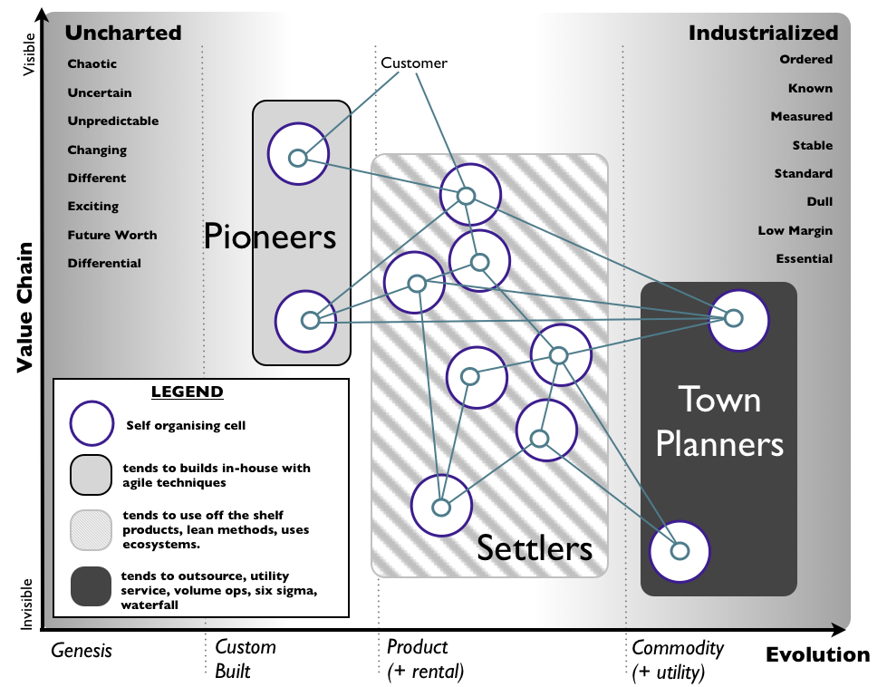

# Personalities and Affinities

- Personality tests (the Color test, Red/Green/Blue, etc) are _damaging_ and conducive to _permanent labels_ - *avoid them at all cost*.
- Personalities aren't immutable. Focus on classifying _where people currently stand in their life+career_ and how to empower them with that in mind.

## Pioneers, Settler and Town Planner

- Identify individuals with interest and skillset for each phase of a project and allocate them properly.
- Unless your goal (agreed w/ the report) is to challenge growth on a new area, don't send someone who's an eager planner/structure-builder to build a prototype, or an pioneer/explorer to set the standards for the entire team.
- Build the framework to support hand-over between groups. Plan proper transitions.
- Avoid stack-ranking groups. _All 3 are equally important_.
- Startups tend to attract/value _only Explorers_, therefore everything is on fire.
- Consultancies tend to attract/value _only Settlers_, therefore innovation doesn't happen/products don't get built.
- Big bureaucracies tend to attract/value _only_ Town Planners, therefore innovation and execution suffer.
- No one _is_ a pioneer/settler/town planner _permanently_.
- _All teams_ should have a mix of the 3 types. Homogenous teams are not effective.

### Role:Value alignment

- Align roles to different stages on the value chain.

## References
- [Commandos, Infantry, and Police](https://blog.codinghorror.com/commandos-infantry-and-police/)
- [Pioneers, Settlers and Town Planners](https://agilebusinessmanifesto.com/agilebusiness/a-structure-for-continuous-innovation-pioneers-settlers-town-planners/) 