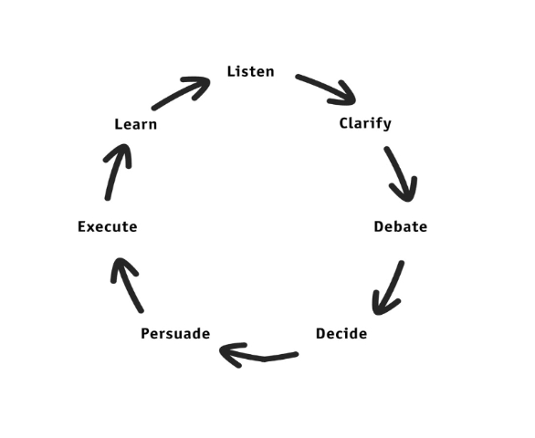

# Getting buy-in

## Radical Candor buy-in framework
- Telling people what to do does not work
- As the boss, you are the editor, not the author
- Buy-in cycle: Listen, Clarify, Debate, Decide, Persuade, Execute, Learn

## Assertive Inquiry
- People’s default mode of communication tends to be _advocacy_ - argumentation in favor or their own conclusions and theories, statements about the truth of their own point of view.
- Advocate your view as a possibility, not as the single right answer.
    - “This is how I see the situation, and why; to what extent do you see it differently?”
- Listen carefully and ask questions about alternative views.
    - “It sounds to me like your argument is this; to what extent does that capture your argument accurately?” 
- Explain gaps in your understanding of the other person’s views, and ask for more information
    - “It sounds like you think this acquisition is a bad idea. I’m not sure I understand how you got there. Could you tell me more?”

## References

- [Playing to Win: how strategy really works](https://www.amazon.com/gp/product/142218739X)

- [Notes from Radical Candor - Kim Scott](https://hackernoon.com/notes-from-radical-candor-kim-scott-b663c019d025)