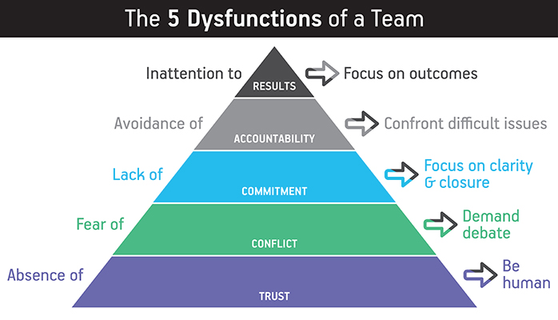
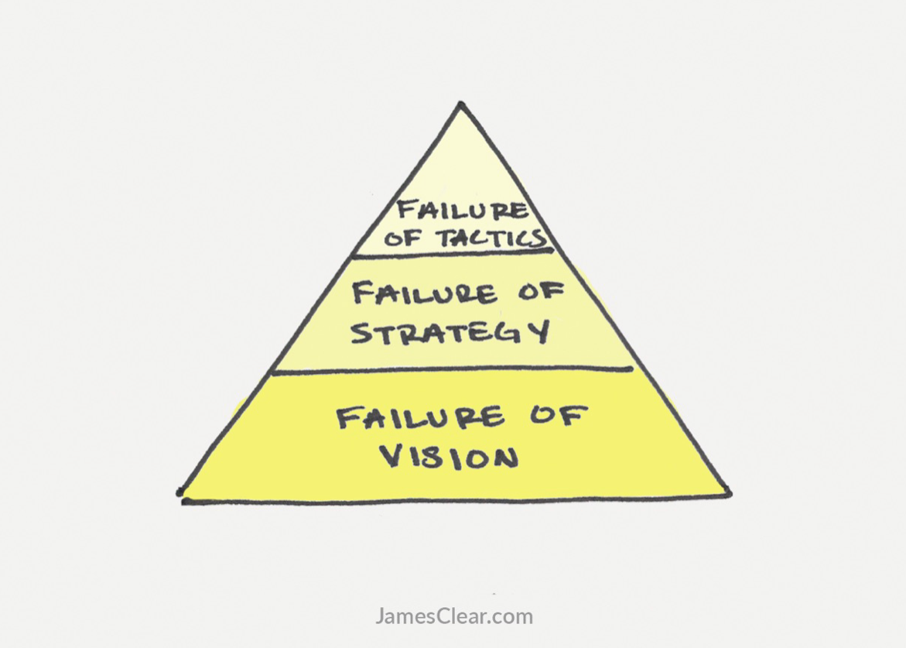

# Five dysfunctions of a team

## Absence of trust

> Teams that lack trust waste inordinate amounts of time and energy managing behaviors and interactions within the group.
>
> If we don’t trust one another, then we aren’t going to engage in open, constructive, ideological conflict. And we’ll just continue to preserve a sense of artificial harmony.

Mistrust

- Conceal their weaknesses and mistakes from one another
- Hesitate to ask for help or provide constructive feedback
- Hesitate to offer help outside their own areas of responsibility
- Jump to conclusions about the intentions and aptitudes of others without attempting to clarify them
- Fail to recognize and tap into one another’s skills and experiences
- Hold grudges
- Dread meetings and find reasons to avoid spending time together

Trust

- Admit weaknesses and mistakes
- Ask for help
- Accept questions and input about their areas of responsibility
- Give one another the benefit of the doubt before arriving at a negative conclusion
- Take risks in offering feedback and assistance
- Appreciate and tap into one another’s skills and experiences
- Focus time and energy on important issues, not politics
- Offer and accept apologies without hesitation
- Look forward to meetings and other opportunities to work as a group

## Fear of conflict

> Great teams do not hold back with one another. They are unafraid to air their dirty laundry. They admit their mistakes, their weaknesses, and their concerns without fear of reprisal.
It’s as simple as this. When people don’t unload their opinions and feel like they’ve been listened to, they won’t really get on board.

Mistrust

- Have boring meetings
- Create environments where back-channel politics and personal attacks thrive
- Ignore controversial topics that are critical to team success
- Fail to tap into all the opinions and perspectives of team members
- Waste time and energy with posturing and interpersonal risk management

Trust

- Have lively, interesting meetings
- Extract and exploit the ideas of all team members
- Solve real problems quickly
- Minimize politics
- Put critical topics on the table for discussion

## Lack of commitment

> Most reasonable people don’t have to get their way in a discussion. They just need to be heard, and to know that their input was considered and responded to.
>
> Politics is when people choose their words and actions based on how they want others to react rather than based on what they really think.

Mistrust

- Creates ambiguity among the team about direction and priorities
- Watches windows of opportunity close due to excessive analysis and unnecessary delay
- Breeds lack of confidence and fear of failure
- Revisits discussions and decisions again and again
- Encourages second-guessing among team members

Trust

- Creates clarity around direction and priorities
- Aligns the entire team around common objectives
- Develops an ability to learn from mistakes
- Takes advantage of opportunities before competitors do
- Moves forward without hesitation
- Changes direction without hesitation or guilt

## Avoidance of accountability

> Once we achieve clarity and buy-in, it is then that we have to hold each other accountable for what we sign up to do, for high standards of performance and behavior. And as simple as that sounds, most executives hate to do it, especially when it comes to a peer’s behavior.

Mistrust

- Creates resentment among team members who have different standards of performance
- Encourages mediocrity
- Misses deadlines and key deliverables
- Places an undue burden on the team leader as the sole source of discipline

Trust

- Ensures that poor perfromers feel pressure to improve
- Identifies potential problems quickly by questioning one another’s approaches without hesitation
- Establishes respect among team members who are held to the same high standards
- Avoids excessive bureaucracy around performance management and corrective action

## Inattention to results

> Make the results that we need to achieve so clear that no one would even consider doing something purely to enhance his or her individual status or ego. Because that would diminish our ability to achieve our collective goals. We would all lose.

Mistrust

- Stagnates/fails to grow
- Rarely defeats competitors
- Loses achievement-oriented employees
- Encourages team members to focus on their own careers and individual goals
- Is easily distracted

Trust

- Retains achievement-oriented employees
- Minimizes individualistic behavior
- Enjoys success and suffers failure acutely
- Benefits from individuals who subjugate their own goals/interests for the good of the team
- Avoids distractions

## Levels of failure

## References

- [Deep Dive Study Guide: The Five Dysfunctions of a Team (Summary, Notes, and Tons of Additional Resources)](https://usmanconsulting.com/deep-dive-study-guide-the-five-dysfunctions-of-a-team-summary-notes-and-tons-of-additional-resources/)

- [The Five Dysfunctions of a Team](https://en.wikipedia.org/wiki/The_Five_Dysfunctions_of_a_Team)