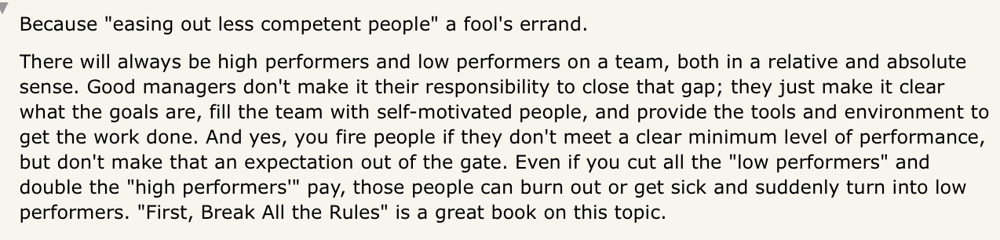

# Coaching for Growth

Coaching for Growth == levelling up individuals who may not _yet_ be up-to-par. Coaching for performance == levelling up already stellar individuals

## The basics
- Find person’s long term ambitions first (can't grow someone in a direction they don't want to)
- Steep vs Gradual growth phases - **focus on depth (gradual) or impact (steep)**
- Find out where person finds **meaning**, create an environment to help them w that
- Don’t offer solutions, offer *challenges*
- Junior devs/newcomers: ask as many clarifying questions as possible (don't know what I don't know)

## Aligning growth trajectories

"Radical Candor" recommendation: ask managers to slot all reports into one of the five boxes, once a year. Urge them to take action on the results.

## Tactics

### Give excellent ratings to everyone who is performing exceptionally
People who have valuable skills but who aren’t likely to “take over the world,” will often be rated as meeting expectations because managers reserve high ratings for people they're going to promote. This creates an unhealthy promotion-obsessed culture.

### Put the gradual growth achievers in positions where they can train others
They will be your best teachers, and it’s a way to put them on stage even when they shy away from the spotlight. If you make them a manager, you’ll destroy an asset.

### Don’t ignore the middle
If someone has been somewhere more than two years and has just met expectations the whole time, it’s time to ask yourself the hard question: If they weren’t there could you hire somebody more likely to excel?

### Evaluate skilled underperformers
If somebody is not doing well in their role but is talented, it’s time to look at yourself in the mirror: Have you put this person in the wrong role? Is your management style just a bad fit for the person? Is this person experiencing a temporary personal problem?

### Make the tough calls
If someone truly is bad at their job and they are unlikely ever to improve — that’s key — you have to fire them. It may seem harsh, but it’s also harsh to let your top performers carry the burden for underperformers.

## You can't "keep only top performers" 

## References

[My Management Lessons from Three Failed Startups, Google, Apple, Dropbox, and Twitter](https://firstround.com/review/My-Management-Lessons-from-Three-Failed-Startups-Google-Apple-Dropbox-Twitter-and-Square/)