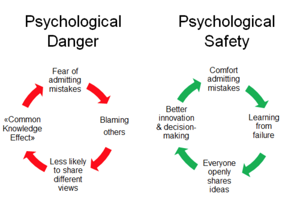
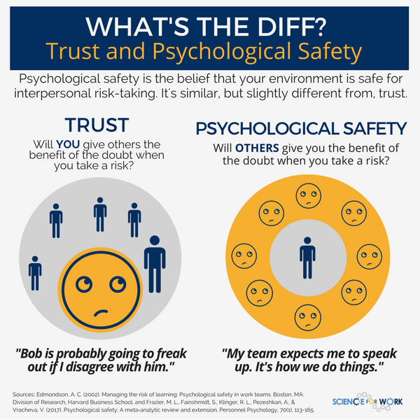
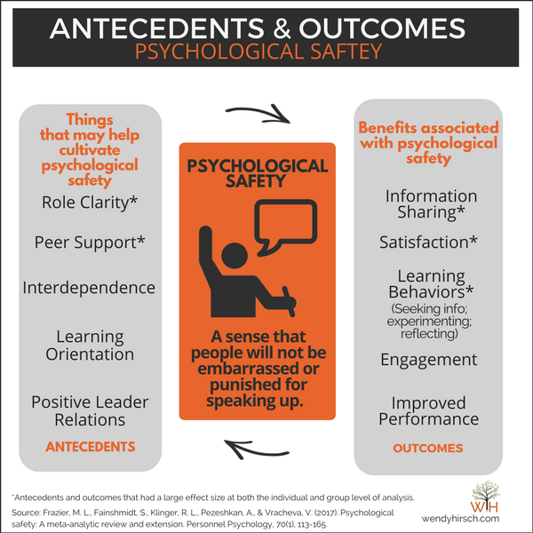
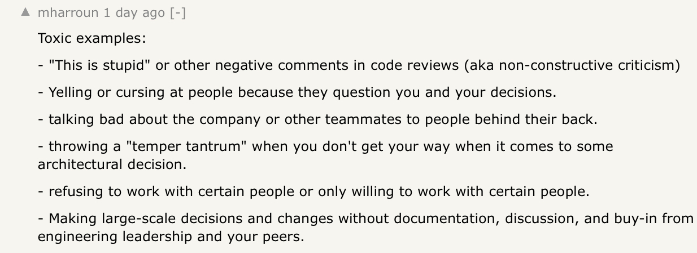

# Promoting psychological safety

| What                                                            | Why  | How  |
|-----------------------------------------------------------------|---|---|
| Create space to disagree                                        | Healthy disagreement leads to better decisions  | Promote design reviews, whiteboarding sessions, roundtables, etc  |
| Let conversation happen, only interject to curb personal angles | It's easy to see a manager as taking sides or to take their opinion as an order  | Interject to stop abusive or escalating behavior. Ask "how" and "what" when debate dies down  |
| Make sure everyone is talking                                   | Prevent loud speakers to dominate all discussions  | Interrupt long talkers. Be on the lookout for disengaged expressions or individuals that said nothing in any discussion  |
| Avoid permanent labels                                          | Undisputed figures of authority alienate fast growers  | Assign leadership per project/initiative. Invite quiet members to propose and lead  |
| Eliminate toxic behavior                                        | Certain behavior has no upsides and diminishes everyone around (including the individual) | Direct/in person situational feedback, clarification of expectations

## Create space to disagree
Why? Healthy disagreement leads to better decisions
How? Promote design reviews, whiteboarding sessions, roundtables, etc

## Innovation requires safety

## Trust vs safety

## Antecedents & outcomes

## What's Toxic behavior?

## References

- [Psychological Safety: A Prerequisite For High Performing Teams](https://www.strategyzer.com/blog/psychological-safety-in-the-workplace-a-prerequisite-for-high-performing-teams)