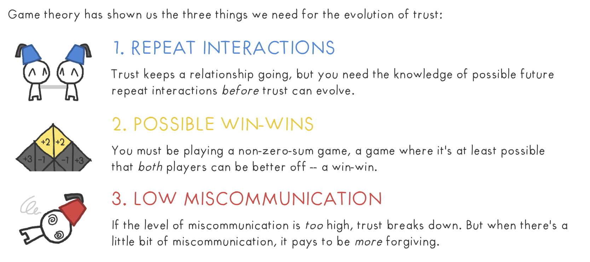
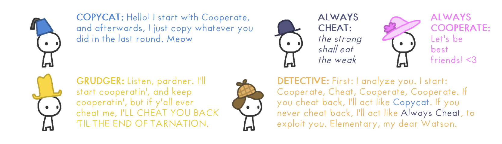

# Relationship building

- One-off meetings lead to transactional behavior
- Build dialogue first, reach out on specific problems later

## Transactional vs Relational behaviors

| Transactional | Relational |
|---------------|------------|
| professional | friendly |
| self-interest | mutual interest | 
| what you get | what you give |
| stay in touch | keep informed |
| understand the process | understand the person in the process |
| judge the results | evaluate the relationship | 
| win conflict | resolve conflict |
| agreement | acceptance |
| evaluate the results | evaluate how the other feels about the results |

## Game Theory

- Build trust by _repeat interactions_, _actively seeking win-wins together_ and _communicate enough_.
- Game Theory models everyone as "players". Copycats & Always-cooperative players lead to better outcomes. Environments dominated by Always-cheat players dwindle.

## References

- [The Evolution of Trust Game](https://medium.com/@alexyakunin/the-evolution-of-trust-313c4aaaf8e)
- [Rewarding Relationships: Observations and Applications | Mark Sanborn Keynote Leadership Speaker](https://marksanborn.com/blog/2009/11/09/rewarding-relationships-observations-and-applications/)
- [9 Differences between Transactional and Relational: How to Tell The Difference | Mark Sanborn Keynote Leadership Speaker](https://marksanborn.com/blog/2013/02/25/9-differences-between-transactional-and-relational-how-to-tell-the-difference/)