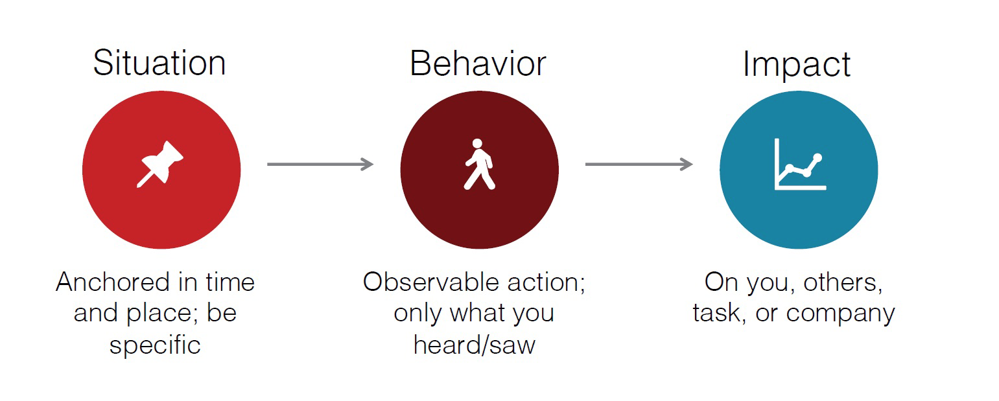
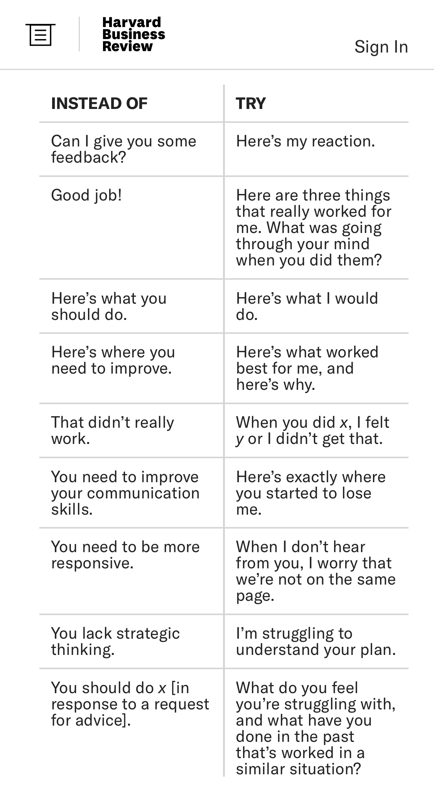
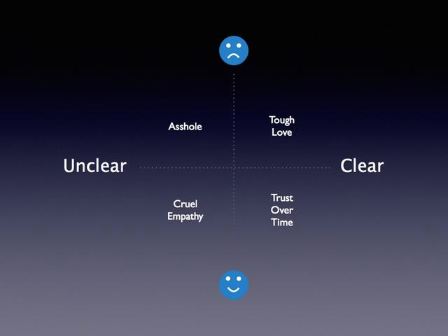

# Giving personal feedback

## Be situational, specific and timely

- Criticism: be clear, show why it's bad, ask how to get back on track
- Address the event/situation, not the person ("the project failed", not "you are a failure")
- Present evidence, not conclusions
- Avoid judging
- Make expectations clear
- Be constant and close to the facts

## Language tips

## Be clear and show you care

Clear and specific feedback is _always_ better, even if it's bad.

## References

- [My Management Lessons from Three Failed Startups, Google, Apple, Dropbox, and Twitter](https://firstround.com/review/My-Management-Lessons-from-Three-Failed-Startups-Google-Apple-Dropbox-Twitter-and-Square/)
- [Why Feedback Rarely Does What It's Meant To](https://hbr.org/2019/03/the-feedback-fallacy)