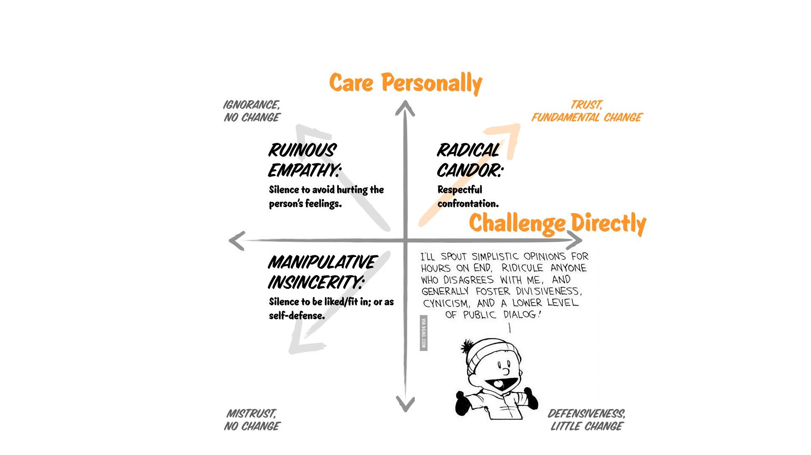

# Giving personal feedback

## Be situational, specific and timely

- Criticism: be clear, show why it's bad, ask how to get back on track
- Address the event/situation, not the person ("the project failed", not "you are a failure")
- Present evidence, not conclusions
- Avoid judging
- Make expectations clear
- Be constant and close to the facts

## Radical Candor's feedback 101

- *Just say it*: Say it in private and say it right away. Criticism has a half-life. The longer you wait the worse the situation gets.
- *Don’t be loose with praise*: If you’re wrong about what you’re praising someone for; if you don’t know the details; if you’re not sincere; it’s actually going to be worse for the person than saying nothing. Praise in public, but only if you know you’re absolutely right and you mean it.
- *Reserve a special one-on-one every quarter with each of your reports.*: Warn them that this is the meeting where they give you feedback. Then make it easy for them to start the conversation. Ask them: "What can I start doing? What should I stop doing? What should I keep doing?" 
- *Embrace the discomfort*: To get people to open up, you have to make them uncomfortable, otherwise they’ll say you’re doing great and will try to move on. Try sitting silently. Figure out a way to make it impossible for people not to tell you what they really think, because if they can get out of telling you what you’re doing wrong, they will.
- *Reward the truth*: If someone working for you has found the courage to tell you what they really think, honor that.

## Language tips

## Care personally

## Be clear and show you care

Clear and specific feedback is _always_ better, even if it's bad.

## References

- [My Management Lessons from Three Failed Startups, Google, Apple, Dropbox, and Twitter](https://firstround.com/review/My-Management-Lessons-from-Three-Failed-Startups-Google-Apple-Dropbox-Twitter-and-Square/)
- [Why Feedback Rarely Does What It's Meant To](https://hbr.org/2019/03/the-feedback-fallacy)