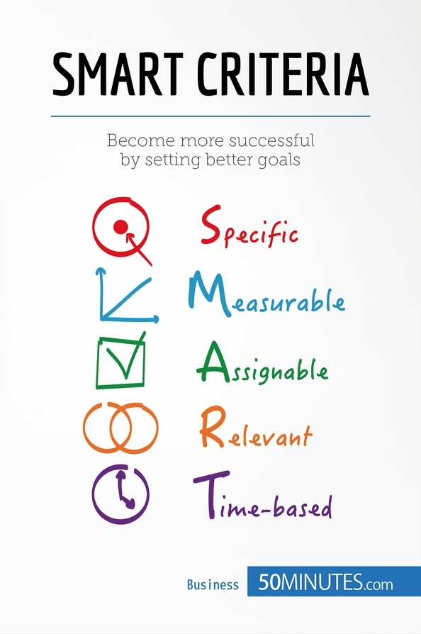

# SMART goals

## **S**pecific

*simple, sensible, significant*

- **What** do I want to accomplish?
- **Why** is this goal important?
- **Who** is involved?
- **Where** is it located?
- **Which** resources or limits are involved?

## **M**easurable

*meaningful, motivating*

- How much?
- How many?
- How will I know when it is accomplished?

## **A**chievable

*agreed, attainable*

- How can I accomplish this goal?
- How realistic is the goal, based on other constraints, such as financial factors?

## **R**elevant

*reasonable, realistic and resourced, results-based*

- Does this seem worthwhile?
- Is this the right time?
- Does this match our other efforts/needs?
- Am I the right person to reach this goal?
- Is it applicable in the current socio-economic environment?

## **T**ime bound

*time-based, time limited, time/cost limited, timely, time-sensitive*

- When?
- What can I do six months from now?
- What can I do six weeks from now?
- What can I do today?

## References

- [SMART Goals: - How to Make Your Goals Achievable](https://www.mindtools.com/pages/article/smart-goals.htm)