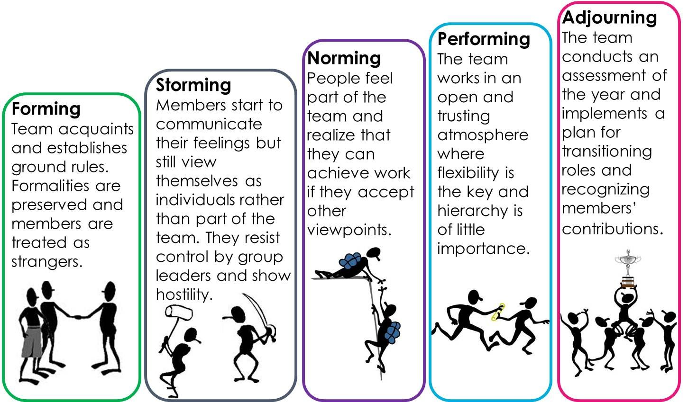

# Tuckman's model

## Teams are immutable

Every change gets you back to the *forming* phase

| Team Development Stage | Leadership Strategies | Keys to success |
|------------------------|-----------------------|-----------------|
| Forming (Setting the stage) | Coordinating Behaviors | Purposefully picking the team. Facilitate team to identify goals. Ensure the team development of a shared mental model |
| Storming (Resolving conflict and tension) | Coaching Behaviors | Act as a resource person to the team. Develop mutual trust. Calm the work environment |
| Norming & Performing (Successfully implementing and sustaining projects) | Empowering Behaviors | Get feedback from staff. Allow for the transfer of leadership. Set aside time for planning and engaging the team |
| Outperforming & Adjourning (Expanding initiative and integrating new members) | Supporting Behaviors | Allow for flexibility in team roles. Assist in the timing and selection of new member. Create future leadership opportunities | 

## References

[Tuckman's stages of group development](https://en.wikipedia.org/wiki/Tuckman%27s_stages_of_group_development)