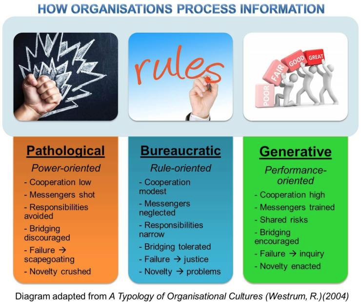

# The Westrum Organizational model

**Three types of organizations**

- Power-oriented (pathological)
- Rule-oriented (bureaucratic)
- Performance-oriented (generative)

## TLDR
> A *pathological* culture, for example, focuses on the leader’s personal interests and resources. The information is, thus, processed in a way to further or advance particular parties within the organization rather than benefit the organization as a whole i.e. /power-oriented/.
>
> A *bureaucratic* culture will focus on the use of standard channels and procedures to process information through the various organizational areas. Whilst seemingly innocent, this becomes problematic and insufficient when having to deal with problems or crises encountered by the organization i.e. /rule-oriented/.
>
> Contrary to both of these, a *generative* culture tends to be more proactive, focusing on getting the information to the correct people and organizational areas by any means required. In generative cultures, the leader places emphasis on accomplishing the organizations goals and missions timely, rather than on personal gain or rules i.e. /performance-oriented/.

## Identifying culture

- On my team, information is actively sought.
- On my team, failures are learning opportunities, and messengers of them are not punished.
- On my team, responsibilities are shared.
- On my team, cross-functional collaboration is encouraged and rewarded.
- On my team, failure causes enquiry.
- On my team, new ideas are welcomed.

## References

- [A typology of organisational cultures](https://qualitysafety.bmj.com/content/13/suppl_2/ii22.short)